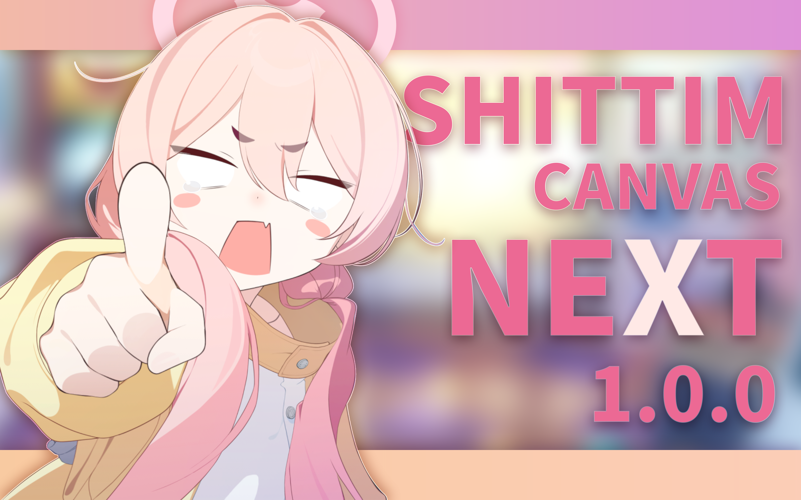
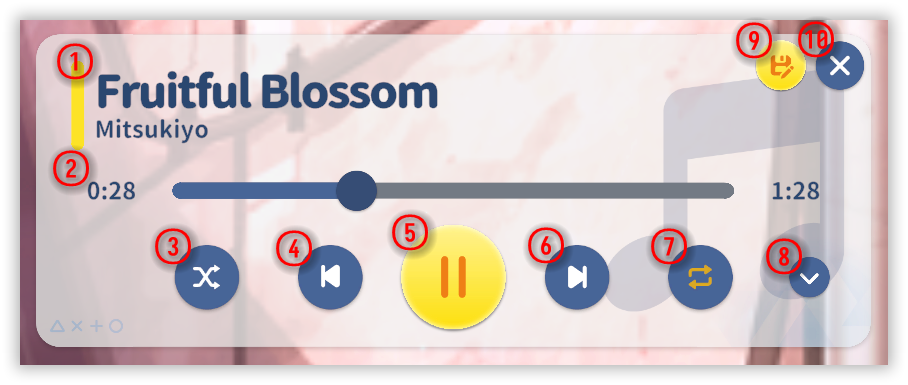
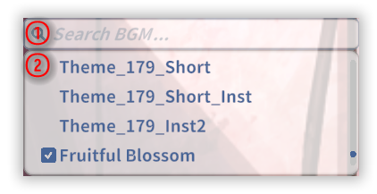
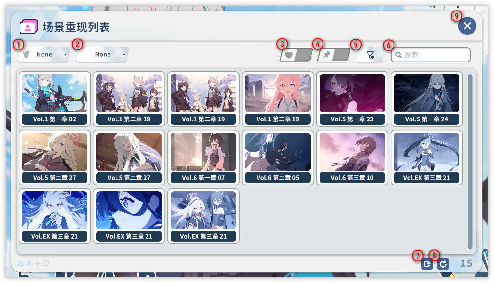
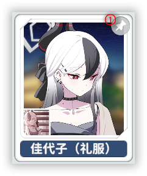
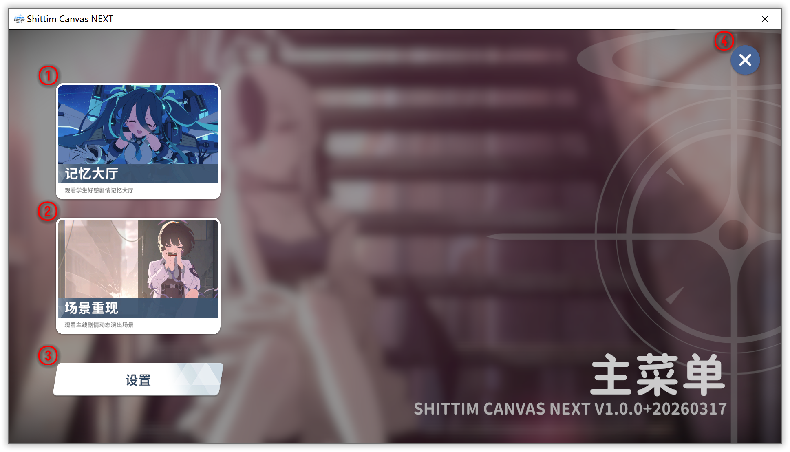
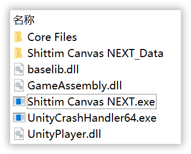
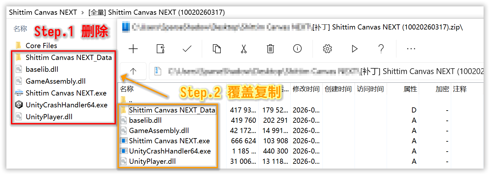

<div align="center">



# Shittim Canvas NEXT v1.0.0+20260317 使用文档


*本文档 100% 由人类（具体来讲就是一只疏影）纯手工书写，包含 0% 的 AI 生成的内容，请放心阅读。*  
*（Emoji 是我在预览网站一个一个挑的，为了让文档看起来没那么枯燥，结果被说像 AI 了，特此声明）*

</div>

# 📖 零、前言

## 📌 1. 简介

-   **Shittim Canvas NEXT** 是一款基于 **Unity** 开发的展示型工具软件，可以用作 **桌面壁纸** 或是 **桌宠**，专注于还原《蔚蓝档案》中的平面动态场景内容，包括 **记忆大厅**、**剧情动态背景** 等资源的播放与展示效果。

-   项目的目标是完美复刻游戏内表现，复现原作中的视觉呈现、动画逻辑与交互细节，并在此基础上提供更高的可扩展性与自定义能力。

## ✨ 2. 特性

- ### 🎮 高还原度
    - 还原游戏内记忆大厅与剧情动态背景的整体视觉效果
    - 还原粒子特效、后期处理等视觉层面的表现
    - 还原游戏内播放动画的混合参数与完整逻辑等
    - 还原游戏内响应用户交互的完整逻辑
    - 还原场景的环境音与开场音效等音频层面的表现

- ### 🛠️ 高自定义程度
    - 计划支持导入并自定义 **Spine 4.2** 版本的记忆大厅资源
    - 计划扩展更多非官方的自定义功能
    - 计划支持扩展官方记忆大厅原有的交互形式
    - 计划支持可自定义的交互区域

## 👤 3. 开发者

<table>
  <tr>
    <td align="center">
      <a href="https://github.com/SparseShadow2024">
        
        <br />
        <b>Sparse Shadow</b>
      </a>
      <br />
      <sub>🔧 主要开发者</sub>
    </td>
    <td align="center">
      <a href="https://github.com/Japerz12138">
        
        <br />
        <b>Japerz</b>
      </a>
      <br />
      <sub>🎨 UI 设计</sub>
    </td>
  </tr>
</table>

# 🗺️ 一、总览

  

| 图示 | 功能 |
| ---- | ---- |
| ① | **[基础 Dock 栏](#1-基础-dock-栏)** <br> 调整当前角色及其配置。|
| ② | **[功能 Dock 栏](#2-功能-dock-栏)** <br> 快捷直达常用功能。|
| ③ | **音乐播放器浮窗** <br> 显示[音乐播放器](#3-音乐播放器)。|

# ⚙️ 二、细则

## 1. 基础 Dock 栏

- ### 记忆大厅角色
    
- ### 剧情动态壁纸
    

| 图示 | 功能 |
| ---- | ---- |
| ① | **触摸交互开关** <br> 是否启用角色的点击交互事件，例如对话（壁纸模式也生效）。|
| ② | **拖拽交互开关** <br> 是否启用角色的拖拽交互事件，例如摸头、视线跟随以及特殊交互（壁纸模式也生效）。|
| ③ | **色彩校正开关** <br> 是否启用官方预制的色彩校正效果（壁纸模式也生效）。|
| ④ | **色差效果开关** <br> 是否启用官方预制的屏幕色差效果（壁纸模式也生效）。|
| ⑤ | **字幕开关** <br> 是否显示字幕文本（壁纸模式也生效）。|
| ⑥ | **自设音乐开关** <br> 是否启用自定义背景音乐（壁纸模式也生效）。|
| ⑦ | **设为默认按钮** <br> 将当前角色设为 SCNX 软件的默认显示角色，同时也会设为切换至此类角色时默认展示角色。|
| ⑧ | **角色列表按钮** <br> 打开[角色选择窗口](#5-角色选择窗口)。|
| ⑨ | **快捷收藏列表按钮** <br> 以启用收藏过滤的状态打开[角色选择窗口](#5-角色选择窗口)。|

## 2. 功能 Dock 栏

  

| 图示 | 功能 |
| ---- | ---- |
| ① | **HUD 可见性开关** <br> 是否显示 UI 元素。|
| ② | **全屏切换按钮** <br> 是否全屏显示 SCNX 软件。|
| ③ | **进入壁纸模式按钮** <br> 以当前窗口所在显示器为目标，进入[壁纸模式](#10-壁纸模式)。|
| ④ | **主菜单按钮** <br> 打开主菜单。|

## 3. 音乐播放器

  

| 图示 | 功能 |
| ---- | ---- |
| ① | **歌曲信息** <br> 显示当前音乐的标题和作者。|
| ② | **播放进度** <br> 显示当前音乐的播放进度信息。|
| ③ | **随机播放开关** <br> 是否启用随机播放音乐。|
| ④ | **上一首音乐按钮** <br> 按照播放策略切换至播放列表的上一首音乐。|
| ⑤ | **暂停音乐按钮** <br> 切换音乐播放状态。|
| ⑥ | **下一首音乐按钮** <br> 按照播放策略切换至播放列表的下一首音乐。|
| ⑦ | **单曲循环开关** <br> 是否启用单曲循环播放音乐。|
| ⑧ | **播放列表开关** <br> 是否折叠[播放列表](#4-音乐播放器播放列表)。|
| ⑨ | **设为自定义音乐按钮** <br> 将当前音乐设为当前角色的自定义音乐。|
| ⑩ | **关闭播放器按钮** <br> 隐藏音乐播放器。|

## 4. 音乐播放器（播放列表）

  

| 图示 | 功能 |
| ---- | ---- |
| ① | **搜索输入框** <br> 搜索音乐（功能未实装）。|
| ② | **播放列表下拉框** <br> 选择音乐。|

## 5. 角色选择窗口

- ### 记忆大厅角色
    
- ### 剧情动态背景
    

| 图示 | 功能 |
| ---- | ---- |
| ① | **学院过滤器** <br> 在当前角色列表结果中筛选出指定学院的结果。|
| ② | **社团过滤器** <br> 在当前角色列表结果中筛选出指定社团的结果。|
| ③ | **好感显示开关** <br>  是否在角色卡片上显示好感度图标。|
| ④ | **收藏过滤器** <br> 是否在当前角色列表结果中启用收藏的结果。|
| ⑤ | **清除过滤器** <br> 重置当前所有过滤器。|
| ⑥ | **搜索输入框** <br> 搜索角色（支持简中名、繁中名、英文名、日文名以及昵称，昵称由于同步方案不成熟需要自行添加）。|
| ⑦ | **导入角色包按钮** <br> 导入角色包。|
| ⑧ | **刷新角色列表** <br> 刷新所有角色数量、信息。|
| ⑨ | **关闭窗口按钮** <br> 隐藏角色选择窗口。|

## 6. 角色卡片（记忆大厅角色）

- ### 记忆大厅角色
    
- ### 剧情动态背景
    

| 图示 | 功能 |
| ---- | ---- |
| ① | **设为收藏按钮** <br> 当鼠标指针置于角色卡片上时，显示按钮，点击切换当前角色的收藏状态。|

## 7. 主菜单

  

| 图示 | 功能 |
| ---- | ---- |
| ① | **记忆大厅角色按钮** <br> 进入记忆大厅角色模式。|
| ② | **剧情动态背景按钮** <br> 进入场景重现模式。|
| ③ | **设置按钮** <br> 打开[设置](#8-设置窗口)窗口。|
| ④ | **关闭页面按钮** <br> 隐藏主菜单页面。|

## 8. 设置窗口

  

## 9. 编辑模式

  

### 快捷键：
- 在 **主页面** 点按快捷键 `Ctrl E` 来进入编辑模式
- 在 **编辑模式** 点按快捷键 `Ctrl E` 来退出编辑模式
- 在 **编辑模式** 点按快捷键 `Ctrl R` 来复原角色变换

### 鼠标手势
- 在 **编辑模式** 点击后拖拽 `鼠标左键` 来移动角色
- 在 **编辑模式** 滚动 `鼠标中键` 来移动旋转角色
- 在 **编辑模式** 点击后拖拽 `鼠标右键` 来缩放角色

## 10. 壁纸模式


| 图示 | 功能 |
| ---- | ---- |
| ① | **覆盖窗口应用名过滤按钮** <br> 将当前覆盖窗口的应用名加入操作屏蔽的白名单列表。|
| ② | **覆盖窗口句柄过滤按钮** <br> 将当前覆盖窗口的句柄加入操作屏蔽的白名单列表（不推荐，因为窗口的句柄是动态变化的）。|
| ③ | **覆盖窗口类名过滤按钮** <br> 将当前覆盖窗口的类名加入操作屏蔽的白名单列表。|

# 🔄 三、软件与角色的更新

## 1. 全量包

全量包指的是带有前缀 `[全量]` 的压缩包，例如 `[全量] Shittim Canvas NEXT (xxxxxxxxxxx).zip`，其中包含了软件本体、目前版本的所有角色资产和元数据及其依赖资产。



全量包解压得到的是一个可以直接运行的程序，无需多余操作。

## 2. 补丁包

补丁包指的是带有前缀 `[补丁]` 的压缩包，例如 `[补丁] Shittim Canvas NEXT (xxxxxxxxxxx).zip`，其中只包含了软件本体。


补丁解压得到的是 SCNX 的本体部分，更新需要：

1. 将已存在的 `Shittim Canvas NEXT` 文件夹（指的是 SCNX 软件的存放位置，不一定是这个名称）中 **除了 `Core Files` 文件夹以外的文件** 全部 **删除**；

2. 将补丁包中的所有文件解压到已存在的 `Shittim Canvas NEXT` 文件夹中，所有文件应该与 `Core Files` 文件夹 **同级**，其中由于可能会有配置文件的更新，所以如果出现 **冲突提醒**，请执行 **覆盖** 操作；



## 3. 角色包

角色包指的是带有前缀 `[角色]` 的压缩包，例如 `[角色] SCNX V(x.x.x) (xxx).zip`，其中只包含了角色资产和元数据。


角色包解压得到的是角色资产和元数据，更新需要将角色包中的所有文件 **覆盖** 解压到已存在的 `Shittim Canvas NEXT` 文件夹中，所有文件应该与 `Shittim Canvas NEXT.exe` 文件 **同级**

# ❓ 四、常见问题

## 1. 如何查找日志文件？

日志文件 `Player.log` 位于本地路径 `C:\Users\用户名\AppData\LocalLow\Game Dev Dep\Shittim Canvas NEXT\Player.log`

在 **主菜单** → **设置** → **关于** → **日志文件夹** 中可以一键打开日志文件所在的文件夹

## 2. 无法进入壁纸模式？

该问题的成因有很多，我们建议逐步排查：  

- ① 关闭其他壁纸软件（如 Wallpaper Engine、Lively 等）。
- ② 关闭桌面美化工具（如 CoolDesk、腾讯桌面整理、雨滴 等）。
- ③ 关闭或查看杀毒软件日志，确认操作是否被拦截。
- ④ 在任务管理器中重启资源管理器。
- ⑤ 重启计算机以保证窗口管理器处于正常状态。

如上述操作无法解决问题，请在任意[反馈渠道](#五社群)向开发者提供[日志文件](#1-如何查找日志文件)

## 3. 壁纸模式下无法交互？

若[窗口覆盖指示器](#10-壁纸模式)存在，则说明检测到该窗口正在阻挡壁纸交互，请使用任意过滤规则将该窗口加入白名单

## 4. 无法与窗口覆盖指示器交互？

该问题的成因尚不明晰，尝试手动添加窗口至操作屏蔽的白名单，注意，以下任意添加一项即可生效：

- ① 使用任意文本编辑器打开 `Shittim Canvas NEXT\Core Files\Config Files\Custom_Window_Config.json`
- ② 在 `"Custom_Exclusive_Process_Name_List"` 条目中填入 **应用名** 信息，例如 `"Custom_Exclusive_Process_Name_List": ["设置", "计算器"],`
- ③ 在 `"Custom_Exclusive_Handle_List"` 条目中填入 **句柄** 信息，例如 `"Custom_Exclusive_Handle_List": ["00000001", "00000002"],`
- ④ 在 `"Custom_Exclusive_Class_Name_List"` 条目中填入 **类名** 信息，例如 `"Custom_Exclusive_Class_Name_List": ["Chrome_WidgetWin_1", "Chrome_WidgetWin_2"],`
- ⑤ 重启应用

如上述操作无法解决问题，请在任意[反馈渠道](#五社群)向开发者提供[日志文件](#1-如何查找日志文件)

## 5. 如何在音乐播放器中添加本地音乐？

① 使用任意文本编辑器打开 `Shittim Canvas NEXT\Core Files\Config Files\BGM_Meta_Info_Config.json`  
② 参考已有自定义歌曲条目 "-1" 来修改，（注意：自定义歌曲的 ID 应为 **负数**，所以下一个自定义元数据的 ID 应该为 -2），目前支持 `mp3`、`flac`、`aiff`、`wav`、`ogg` 格式
``` json
"-1": {
    "BGM_Id": -1,
    "BGM_Name": "TV WORLD",
    "BGM_Author": "Toby Fox",
    "BGM_File_Path": "D:/Games/Steam/steamapps/common/DELTARUNE/mus/tv_world.ogg"
}
```
③ 重启应用

## 6. SCNX 的仓库为什么不像 SC 一样保持开源？

由于 SCNX 的项目大量使用了一些神秘原理来进一步复刻游戏的各种效果与逻辑，因而不适合开源，容易招来神秘大手。

如果您有意向向 SCNX 贡献代码的话，欢迎与[开发者](#-3-开发者)交流，只要是真心想为软件的开发出一份力的话，我们无比欢迎！

如果您担心 SCNX 存在恶意代码与后门的话，也欢迎与[开发者](#-3-开发者)交流，不开源只是防止被橄榄，而不是开发者真的精力过剩，有什么不可告人的邪恶阴谋，敬请谅解喵。

# 👥 五、社群

通过以下方式了解项目动态、反馈问题或参与讨论：
- 🌐 **官网**：<https://sc.japerz.com/>
- 💬 **QQ 群**：`961293316`
- 🟣 **Discord 群组**：<https://discord.gg/SWVmq3mX5n>

# 📝 六、后话

## ⚠️ 免责声明

本项目是基于个人兴趣开发的非官方粉丝向工具，仅供学习、研究和非商业交流使用。
本项目与 《蔚蓝档案 / Blue Archive》 及其相关开发、发行、运营主体不存在任何授权、认可、合作或从属关系。

## 📄 关于开源协议

本项目中由开发者原创编写的程序代码，按照 GPL-3.0 协议开源。
但 《蔚蓝档案 / Blue Archive》 相关的游戏名称、角色形象、商标、立绘、美术资源、Spine 动画、音频及其他游戏资产，其知识产权均归各自权利人所有，不因本项目采用 GPL-3.0 而改变权利归属，也不适用 GPL-3.0。

## 🗂️ 关于资源使用

本项目原则上仅对工具功能本身进行开源与分发，不当然包含或授权分发任何未经许可的游戏资产。
如使用者自行获取、导入或使用相关游戏资源，应自行确认其来源合法，并确保相关行为符合适用法律法规、权利人要求及相关服务条款。

## 👤 使用者责任

使用本项目即表示你理解并同意：
你应自行承担因资源获取、导入、使用、传播等行为所产生的法律责任；
开发者不鼓励、支持或认可任何侵犯著作权、商标权、名誉权或其他合法权益的行为；
任何用户利用本项目从事违法违规活动，均与项目开发者无关。

## 📮 权利人联系

如果你是相关权利人，认为本项目的内容、说明或分发方式可能侵犯你的合法权益，请联系项目开发者。
在核实后，开发者将及时采取必要措施，包括但不限于删除相关内容、停止分发、调整功能或补充说明。